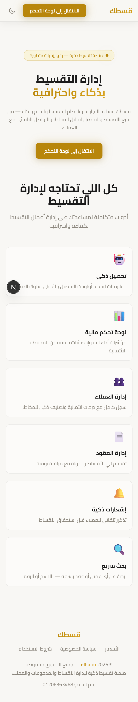
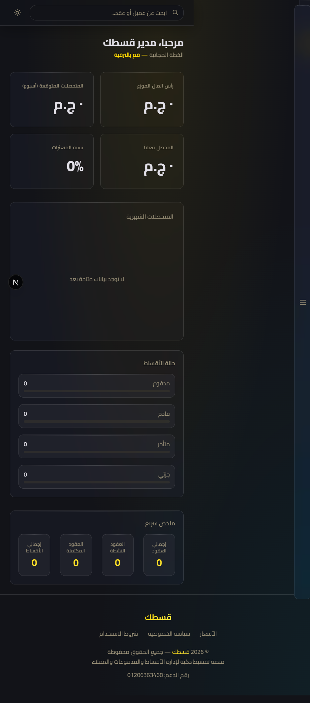
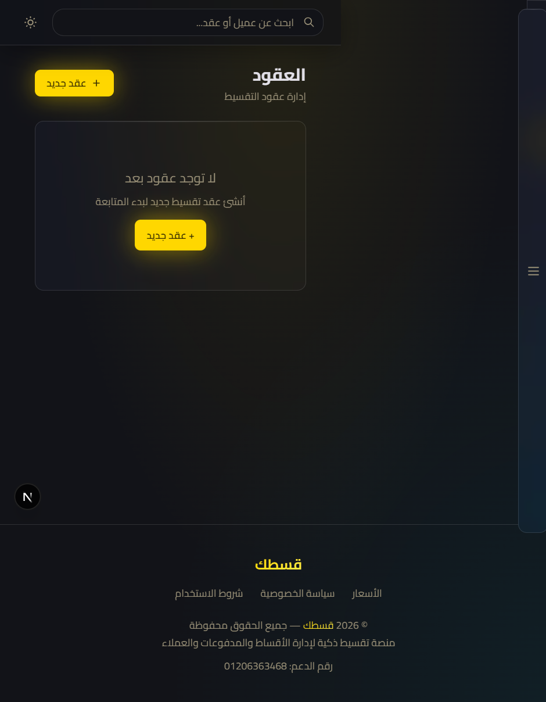
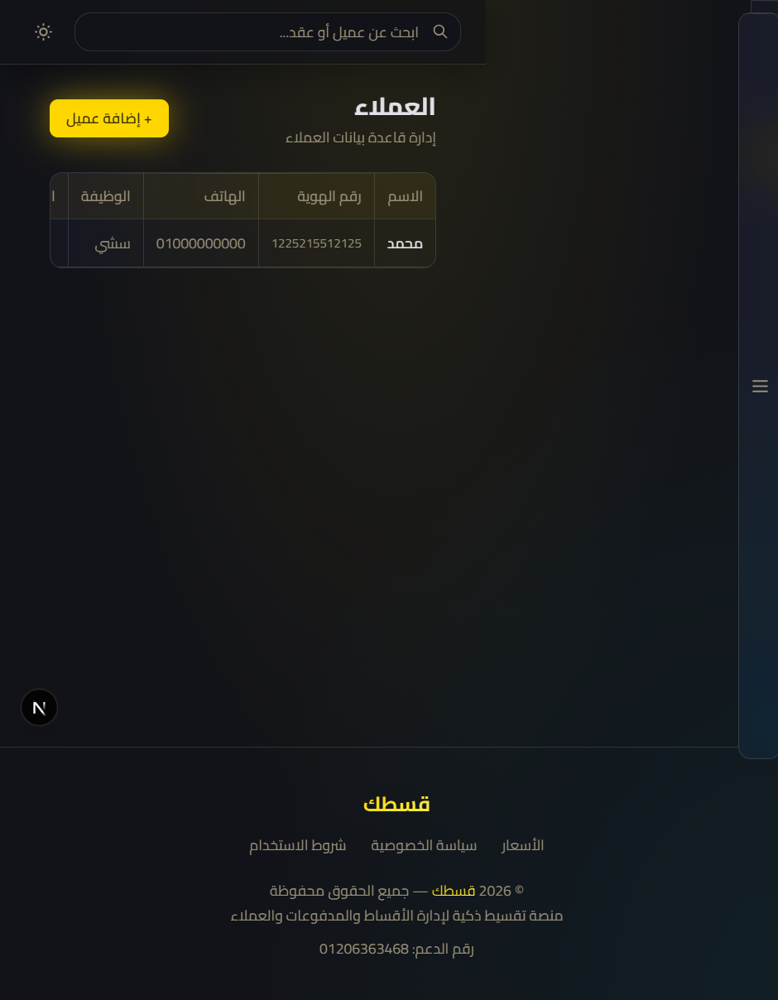
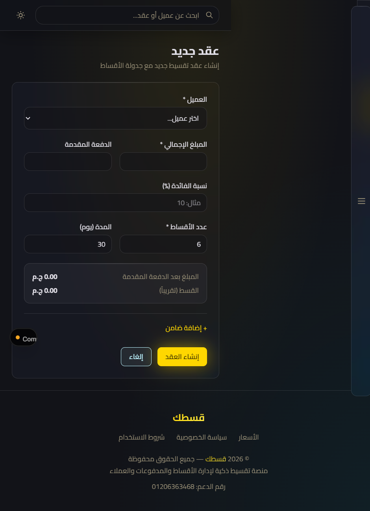
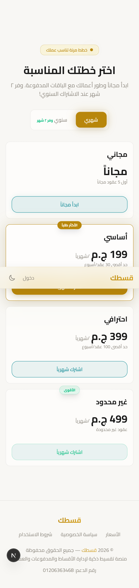

# Qestak — قسطك

**منصة تقسيط ذكية لإدارة الأقساط والمدفوعات والعملاء — حل متكامل للتجار والشركات الصغيرة.**

🔗 **Live demo:** [qestak.vercel.app](https://qestak.vercel.app)



## ✨ Features

| Feature | Description |
|---------|-------------|
| **Dashboard** | Real-time KPIs and portfolio stats (Recharts) |
| **Contracts** | Create and track installment contracts end-to-end |
| **Customers** | Customer profiles with payment behavior |
| **Smart collection** | Collection-priority algorithms based on payment behavior |
| **Offline-first** | Dexie/IndexedDB layer — core flows work without a connection |
| **PWA** | Installable, with service worker + offline route |
| **Auth** | NextAuth (credentials + Google OAuth) |
| **Marketing site** | SSR Arabic landing, pricing, privacy & terms |

## 📱 Screenshots

| Landing | Dashboard | Contracts |
|---|---|---|
|  |  |  |

| Customers | New contract | Pricing |
|---|---|---|
|  |  |  |

## 🧱 Tech Stack

- **Next.js** (App Router) + **TypeScript** + **React**
- **Prisma** + **PostgreSQL** (`@prisma/adapter-pg`)
- **NextAuth** (`@auth/prisma-adapter`, bcrypt)
- **Dexie.js** (offline-first client cache)
- **GSAP** (motion) · **Recharts** (charts) · **Zustand** · **Zod**
- **Tailwind CSS**
- Security headers via `netlify.toml` (X-Frame-Options, nosniff, Referrer-Policy, Permissions-Policy)

## 🚀 Quick Start

```bash
cp .env.example .env   # fill in DATABASE_URL, AUTH_SECRET, CRON_SECRET
npm install
npm run migrate
npm run dev
```

Open [http://localhost:3000](http://localhost:3000).

## 📄 License

MIT — see [LICENSE](LICENSE).
